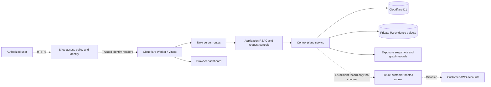
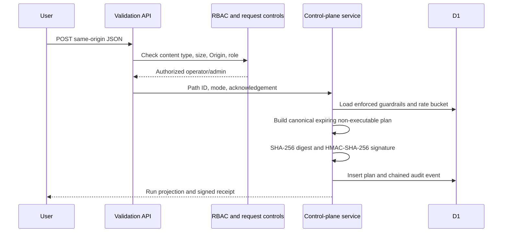

# Architecture and trust boundaries

## Current scope

CloudPen is an AWS-first attack-path validation control plane. The current code loads an explicitly labeled D1 exposure snapshot, accepts constrained plan and review decisions, stores connector/evidence/remediation/reporting records, and stages non-executable discovery and runner-enrollment intent. It performs no AWS API calls and has no runner communication channel.

## System context

## Components

| Component | Responsibility | Security notes |
| --- | --- | --- |
| Sites dispatcher | External access restriction and user identity | Identity only; application role checks remain mandatory |
| Worker | Request entry point, runtime bindings, response hardening, image handling | Removes identifying headers; applies CSP, framing, MIME, privacy, and transport controls |
| Server page | Requires identity and application membership before rendering the dashboard | Per-request dynamic rendering prevents shared authenticated output |
| API routes | Parse request contracts and require capabilities | Mutation routes require same-origin bounded JSON or screenshot multipart bodies |
| Control-plane service | Business rules, plan signing, evidence packaging, audit chaining, rate limits | Server-only module; browser cannot mark runs complete or executable |
| D1 | Durable workspace, exposure graph, connector, validation, evidence, remediation, runner-staging, audit, and rate-limit state | Queries use prepared statements and workspace scoping |
| R2 | Private screenshot PNG bodies | No public URL; object keys are server-derived and resolved through workspace-scoped D1 metadata |
| Browser dashboard | Presentation and user interaction | Receives a server-owned snapshot with explicit provenance; browser state is non-authoritative |

## Trust boundaries

### 1. Untrusted client to trusted dispatcher

Attackers can control request methods, headers, bodies, timing, and browser state. Hosted production must be reachable only through the Sites dispatcher. Direct exposure of the Worker behind an untrusted proxy would make identity-header provenance an open question and is not supported by this design.

### 2. Dispatcher identity to application authorization

An authenticated email is mapped server-side to one role through environment allowlists. A Sites visitor without an application role is denied. Role order is deterministic: admin, operator, reviewer, then viewer.

### 3. API route to durable state

Route handlers validate method-specific contracts before invoking the control-plane service. The service uses prepared D1 statements, workspace scoping, and server-derived actor identity. Request-provided identities, workspace IDs, statuses, signatures, and timestamps are not accepted.

Screenshot capture is the bounded exception where the browser supplies a client capture timestamp and stamped PNG. The service restricts the timestamp to a short clock window, validates the selected framework/control pair and PNG structure, derives all storage paths, hashes the bytes, and records the authenticated actor. The browser never supplies an R2 object key or workspace ID.

### 4. Control plane to future runner

No connection exists. Plans contain `executable: false`; an approved active-canary plan records intent only. Discovery jobs and pending runner enrollments are database-constrained to `executable = 0`. Adding a delivery channel or AWS credential exchange changes the highest-risk trust boundary and requires the mandatory design in `runner-security-design.md`.

## Request flow: validation plan

## Deployment modes

### Local evaluation

`npm start` runs the built Worker through Wrangler on `127.0.0.1:8787`. Local mode supplies a development-only administrator identity and signing key, and D1/R2 state persists under the ignored `.wrangler/state` directory. This is not an authentication model for shared environments.

### Hosted private deployment

Sites provides identity, private/custom access, D1 binding injection, and environment variables. Local mode must be absent. The hosted administrator/operator/reviewer/viewer lists and a unique production signing key are required.

## Security invariants

1. The browser is never authoritative for roles, approvals, execution, evidence, or audit history.
2. Cloud execution is impossible in this release.
3. Every issued plan is scoped, expiring, signed, stored, logged, and non-executable.
4. Core safety guardrails cannot be disabled through the API.
5. Unauthenticated, unauthorized, cross-origin, malformed, oversized, and over-limit requests fail closed.
6. Missing D1 or signing configuration fails the operation rather than falling back to browser storage.
7. Demo and live provenance must remain visible at every decision and reporting surface.
8. Requesters cannot approve their own active plan.

## Known architectural limitations

- The current deployment is one configured organization. Tables and queries are tenant scoped, but workspace lifecycle and switching are not self-service.
- The first exposure snapshot is a server-owned deterministic demo seed; a real AWS collector is not enrolled.
- HMAC signatures require shared-secret verification and are not suitable for independent third-party attestation.
- Runtime schema initialization duplicates the migration as a compatibility measure and must remain synchronized.
- The framework currently requires inline bootstrap code in the CSP.
