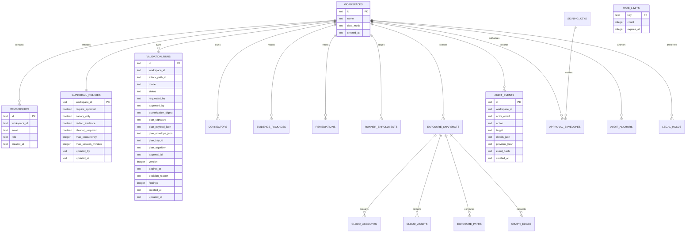

# Data model

CloudPen stores control-plane and exposure-snapshot metadata in D1. The authoritative schema is declared in `db/schema.ts`; migrations upgrade the baseline without discarding existing plans.

## Table semantics

### `workspaces`

Contains the configured organization and an explicit `demo` or `live` provenance mode. Every product table and query is workspace scoped. Self-service workspace creation, deletion, switching, and cross-organization administration are intentionally not exposed yet.

### `memberships`

Records explicit email/workspace role assignments. Authenticated identity plus a matching membership derives tenant context; a request cannot select another workspace. Environment allowlists remain a controlled fallback only when the identity has no membership and does not request a workspace.

Roles:

- `admin`: read, create plans/remediation, configure, request connectors, approve another requester's plan, and stage runner enrollment.
- `operator`: read, create plans, and request connectors.
- `reviewer`: read and approve or reject another requester's active plan.
- `viewer`: read only.

### `guardrail_policies`

Stores mandatory execution-policy values. The current API rejects any attempt to disable approval, canary restriction, evidence redaction, or cleanup. Maximum concurrency and session duration are database constrained but not currently editable through the API.

### `validation_runs`

Stores server-issued plans, canonical payload, versioned envelope, PS256 signature, key ID, expiry, and optimistic-concurrency version. Control-plane transitions include `Planned`, `Awaiting approval`, `Approved`, `Rejected`, `Expired`, and `Stopped`. The signature is reverified before a decision; approval requires a distinct identity and still grants no execution capability. `approval_envelopes` stores the separate signed decision bound to the plan digest.

### Connector and workflow tables

- `connectors` retains AWS account identity, owner, status, synchronization state, and the explicit marker `external_id_status = not-retained`. External IDs and reusable derivatives are absent from the current control-plane schema.
- `evidence_packages` retains signed-manifest metadata while the exported evidence body remains ephemeral.
- `remediations` tracks owner, due date, severity, guidance, optimistic-concurrency version, transition reason, accountable risk acceptance/expiry, revalidation evidence, and a server-governed workflow. A partial unique index permits at most one non-closed remediation per workspace/path.
- `discovery_jobs` stores read-only AWS metadata scope with a database check forcing `executable = 0`.
- `runner_enrollments` pins a reviewed public-key fingerprint in `Pending` or `Disabled` state, also with database-enforced `executable = 0`.

### Exposure graph tables

- `exposure_snapshots` identifies the collection source, status, and timestamp.
- `cloud_accounts`, `cloud_assets`, and `exposure_paths` contain normalized server-owned projections for a snapshot.
- `graph_edges` records directional relationships and bounded evidence metadata used to reconstruct attack reachability.

The current snapshot is a deterministic `demo-seed`. These tables are the ingestion boundary for a future customer-hosted read-only AWS collector; the browser no longer supplies authoritative topology.

### `audit_events`

Stores application-append-only events. Each event hashes its canonical content and the previous event hash. A unique `(workspace_id, previous_hash)` index prevents two successors from silently branching the same chain link. `audit_anchors` stores PS256-signed linked chain heads for independent export. D1 remains tamper-evident, not immutable against an administrator.

### `rate_limits`

Stores per-identity counters and Unix expiry timestamps. Keys include workspace, operation class, and normalized email. Bounded lifecycle maintenance purges expired rows.

### Signing, lifecycle, and delivery tables

- `signing_keys` is the public-key registry with active/retired/revoked state and validity windows; private keys are never stored.
- `consumed_artifact_nonces` is the durable replay boundary reserved for a future independently assessed runner.
- `audit_anchors` stores signed chain heads linked through the preceding anchor digest.
- `legal_holds` records accountable creation and release without deleting history.
- `security_event_outbox` stores canonical event JSON, digest, attempts, backoff, delivery state, and sanitized failure class when SIEM delivery fails.
- `atomic_guards` is a constraint sentinel used inside D1 batches so a security mutation without exactly one audit insert rolls back.

## Mutation and audit atomicity

Security-relevant state changes and their hash-chained audit rows commit in one D1 batch. Conditional updates use compare-and-set predicates, and the audit insert is conditional on exactly one changed row. Audit-tip conflicts are retried with a newly derived chain link, so a failed audit write rolls back its paired mutation. Chain verification reads every row in bounded pages instead of treating histories over a fixed row count as invalid.

## Data classification

| Data | Classification | Current handling |
| --- | --- | --- |
| User email and display name | Internal personal data | Server-derived; email persisted for attribution |
| AWS account ID in connector audit | Confidential tenant metadata | Accepted only after validation; stored in audit details |
| External ID | Confidential confused-deputy context | Browser-generated from 256 random bits; validated then discarded with no raw value, hint, or digest logged |
| Signing private key | Secret | Non-exportable external KMS key; never enters Sites or D1 |
| Public JWK/key status | Public integrity metadata | Stored in `signing_keys` and included in controlled backup exports |
| Plan digest and PS256 signature | Integrity metadata | Payload/envelope/signature stored and reverified before approval |
| Evidence observations | Synthetic confidential sample | Returned in a signed, non-cacheable download |
| Cloud topology | Synthetic sample | Seeded into D1 and server-delivered with explicit demo provenance |

## Retention

`legal_holds` records active/released holds. `security_event_outbox` durably retains failed SIEM deliveries. Lifecycle maintenance removes expired rate counters and confirmed-delivered outbox metadata after seven days unless held. Signed logical backup manifests bind archive digest and row counts. Customer-record deletion and platform restoration remain approved operator procedures described in `data-lifecycle.md`.
