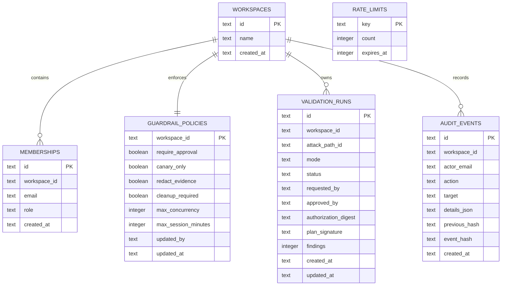

# Data model

CloudPen stores control-plane state in D1. The authoritative schema is declared in `db/schema.ts` and migration `drizzle/0000_cloudpen_control_plane.sql`.

## Table semantics

### `workspaces`

Contains the single synthetic workspace. Multi-tenant workspace creation, deletion, and lifecycle management are not implemented.

### `memberships`

Records users observed after successful environment-allowlist authorization. The environment allowlist remains the authorization source in this release; a membership row alone does not grant access.

Roles:

- `admin`: read, create plans, configure, request connectors, and future approval capability.
- `operator`: read, create plans, and request connectors.
- `reviewer`: read and reserved future approval capability.
- `viewer`: read only.

### `guardrail_policies`

Stores mandatory execution-policy values. The current API rejects any attempt to disable approval, canary restriction, evidence redaction, or cleanup. Maximum concurrency and session duration are database constrained but not currently editable through the API.

### `validation_runs`

Stores server-issued plans and their integrity data. Current writes produce only `Planned` or `Awaiting approval`. No code path advances a plan to execution. `approved_by` is reserved and remains null.

### `audit_events`

Stores application-append-only events. Each event hashes its canonical content and the previous event hash. A unique `(workspace_id, previous_hash)` index prevents two successors from silently branching the same chain link. The chain is tamper-evident, not immutable against a database administrator; external anchoring is a future requirement.

### `rate_limits`

Stores per-identity counters and Unix expiry timestamps. Keys include the operation class and normalized email. Expired rows may be overwritten; scheduled garbage collection is not yet implemented.

## Data classification

| Data | Classification | Current handling |
| --- | --- | --- |
| User email and display name | Internal personal data | Server-derived; email persisted for attribution |
| AWS account ID in connector audit | Confidential tenant metadata | Accepted only after validation; stored in audit details |
| External ID | Confidential authentication context | Never stored; only SHA-256 digest is logged |
| Signing key | Secret | Environment secret only; never stored in D1 or returned |
| Plan digest and HMAC | Integrity metadata | Stored and returned in plan receipt |
| Evidence observations | Synthetic confidential sample | Returned in a signed, non-cacheable download |
| Cloud topology | Synthetic sample | Bundled client-side; unsuitable for real tenant data |

## Retention

Automated retention is not implemented. Before accepting real personal or tenant data, define per-table retention, legal hold, deletion, export, backup, and restoration procedures. Rate-limit rows should have periodic expiry cleanup; audit and plan retention should be driven by security and compliance requirements rather than indefinite storage by default.
