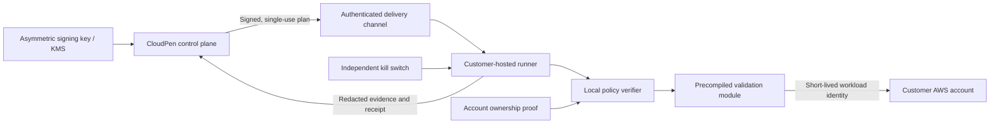

# Customer-hosted runner security design

## Status

Future execution design. The control plane can now stage a `Pending` enrollment record containing a runner name and SHA-256 public-key fingerprint. The database forces that record and every discovery job to `executable = 0`. No enrollment token, command channel, AWS SDK execution, credential exchange, runner attestation, or plan delivery exists. None of the remaining design should be interpreted as implemented behavior.

## Security objective

A future runner may execute only a narrowly defined, customer-authorized validation module against explicitly owned accounts and tagged canary resources. A compromise of the web control plane, browser, or model must not produce arbitrary cloud actions.

## Required architecture



## Mandatory gates

All gates are required before the first real AWS call.

### Identity and enrollment

- Customer explicitly installs the runner in an account they control.
- Enrollment proves workspace, organization, runner instance, and AWS account ownership.
- Runner identity uses short-lived workload credentials and hardware- or platform-bound keys where available.
- Enrollment tokens are single-use, narrowly scoped, short-lived, and never logged.
- Runner certificates and identities support revocation and rotation.

### Plan authorization

- Plans use KMS-backed asymmetric signatures so the runner needs no shared signing secret.
- Signed fields include protocol version, key ID, unique nonce, issued/expiry times, workspace, runner, account, partition, region, module ID/version/digest, allowed resources, allowed actions, parameters, concurrency, session duration, evidence policy, cleanup policy, and approval identities.
- Runner rejects unknown fields in security-critical envelopes, unsupported versions, clock-skew violations, expired plans, reused nonces, key revocation, wrong runner/account/workspace, or any widened scope.
- Active plans require two distinct authorized humans; requester and approver cannot be the same identity.
- High-impact modules require step-up authentication and a time-bounded change/authorization record.

### Execution model

- Only reviewed, versioned, digest-pinned modules are executable.
- No arbitrary shell, script, template, query language, package install, dynamic code, or model-generated API sequence reaches the runner.
- Every module has a static allowlist of AWS services, actions, resource patterns, regions, request parameters, expected responses, cleanup operations, and maximum cost/volume.
- AWS Organizations service control policies, permission boundaries, session policies, and resource tags provide independent enforcement.
- Deny production customer data actions by default; active operations target dedicated tagged canaries.
- Credentials are obtained locally with short STS sessions and never returned to the control plane.

### Network and isolation

- Runner has no inbound public listener.
- Outbound destinations are allowlisted by hostname, port, protocol, and certificate policy.
- Metadata, link-local, loopback, RFC1918, internal DNS, redirects, and arbitrary URLs are blocked unless a module explicitly requires and safely constrains them.
- Run modules in a restricted process/container identity with read-only filesystem, bounded CPU/memory/time, no Docker socket, no host mounts, and no privilege escalation.
- Separate runner execution, evidence redaction, and delivery responsibilities.

### Safety and cleanup

- Preflight independently evaluates plan signature, ownership, permissions, target tags, quotas, maintenance window, and expected blast radius.
- Provide customer-controlled pause and kill switches that do not depend on control-plane availability.
- Enforce maximum operation count, rate, concurrency, data bytes, runtime, and estimated cost.
- Cleanup is idempotent, bounded, retried safely, and verified independently.
- A run cannot become `Completed` until cleanup verification and evidence finalization succeed; otherwise it remains a visible exceptional state.

### Evidence and privacy

- Redact credentials, tokens, payloads, object contents, personal data, and irrelevant response fields inside the customer boundary.
- Evidence records include module digest, signed plan digest, timestamps, actor/approver identities, API request identifiers, redacted outcomes, cleanup proof, and runner attestation.
- Encrypt evidence in transit and at rest with customer/workspace separation.
- Sign evidence asymmetrically and support independent verification without access to a server secret.
- Enforce configurable collection minimization, retention, deletion, export, and legal hold.

### Observability and response

- Emit structured security events for enrollment, plan receipt/rejection, nonce use, API action, policy denial, cleanup, evidence upload, pause, and kill.
- Integrate with customer CloudTrail and SIEM while avoiding secret or payload logging.
- Alert on signature failure, wrong account, replay, expired plan, policy mismatch, scope expansion, unexpected egress, cleanup failure, and unusual volume.
- Maintain signed software updates, SBOMs, provenance, vulnerability response, rollback, and runner fleet inventory.

## Protocol state machine

Allowed progression:

```text
Draft -> Awaiting approval -> Approved -> Delivered -> Preflight passed
      -> Running -> Cleanup verifying -> Evidence finalized -> Completed
```

Every state also permits a transition to `Rejected`, `Expired`, `Stopped`, or `Failed cleanup` where appropriate. No client may write state directly. Each transition requires server and runner evidence, optimistic concurrency protection, and an audit event.

## Prohibited shortcuts

- Adding AWS credentials or an AWS SDK to the web Worker.
- Treating an acknowledgement checkbox as approval.
- Sharing a long-lived IAM user or access key.
- Letting a language model compose arbitrary AWS calls.
- Allowing wildcard resources/actions without an independent deny boundary.
- Fetching customer-provided URLs from the control plane or runner.
- Marking a run complete from a browser timer or unsigned callback.
- Uploading raw cloud responses as evidence.

## Validation before launch

- Formal threat-model review across control plane, protocol, runner, AWS trust, update system, and evidence lifecycle.
- Property tests and fuzzing for canonicalization, signatures, nonce replay, state transitions, parsers, and policy evaluation.
- Isolated synthetic-account destructive testing with budget and organization guardrails.
- Compromise simulations for browser, control plane, signing key, runner host, delivery channel, and CI pipeline.
- Independent application, cloud, runner, and supply-chain penetration test.
- Documented incident response, key revocation, runner kill, evidence recovery, and customer notification exercises.
